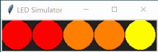
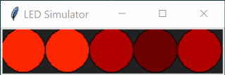
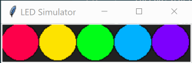
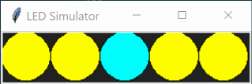
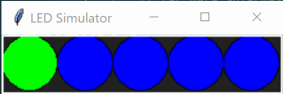
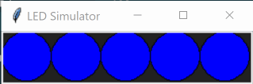

# LED Server

An HTTP interface for controlling Neopixels.

It's a bit very hacky at the moment.

## Setup

### Dependencies

I've only tried this using Python 3.7 because that's the one that runs on my Raspberry Pi.

It's recommended to set up a virtual environment on your Pi so that any dependencies you install don't conflict with any others you've installed in the past.

Setting up a virtual environment can be done in Python 3 like this.

```bash
python3 -m venv venv
```

That will create a folder called `venv`. You can install requirements to this directory using

```bash
./venv/bin/pip install -e .
```

To run on a Raspberry Pi using the GPIO pins, you must also run
```bash
./venv/bin/pip install adafruit-circuitpython-neopixel
./venv/bin/pip install RPi.GPIO
./venv/bin/pip install rpi-ws281x
./venv/bin/pip install sysv-ipc
```

### Hardware

I bought [this set](https://www.amazon.co.uk/gp/product/B07QYW5X78/) of 50 WS2811 LEDs. They're pretty neat.

Using jumper wires, I connected the white wire to the ground pin of the Raspberry Pi (Pin 6), the red wire to the +5v pin (Pin 4) and the green wire to BCM 18 (or Pin 12), using the reference on [pinout.xyz](https://pinout.xyz). This might be a terrible idea - please don't hold me responsible for any permanent damage to the hardware!

### Configuration

Configuration is done by setting environment variables. This program also supports the `.env` file so you can store and reuse your configuration easily. Make a file called `.env` and put it in the root directory of this project. Here's an example with all the options:

```
BRIGHTNESS = 0.1
FRAMES_PER_SECOND = 10
HOST = 127.0.0.1
PIXEL_COUNT = 20
LED_SIZE = 50
PORT = 5000
```

- `BRIGHTNESS`: Between 0 and 1, sets the initial brightness value of the LEDs
- `FRAMES_PER_SECOND`: Number of times the LED colours can be updated in a second. A larger number results in smoother colour transitions, but also more CPU usage.
- `HOST`: When running in server mode, this sets what IP address to bind to. By default it is `127.0.0.1` but if you are having trouble connecting remotely, try setting it to `0.0.0.0` instead.
- `PIXEL_COUNT`: Number of LEDs to control.
- `LED_SIZE`: Only used when simulating the LEDs e.g. when running on a laptop instead of a Raspberry Pi. This controls the size of the circles in the display.
- `PORT`: When running in server mode, this sets what port number to bind to.

### Run the code

Within your virtual environment, you can run `python led_server/led.py`. If you're running on something that isn't a Raspberry Pi, you might well see a simulation of the LEDs pop up on your screen.

Alternatively there are two helper scripts that you can run, `run-pixels` and `run-server`.

`run-pixels` just checks that you've got the LEDs set up correctly. It should turn on all the LEDs and make them show some random colours.

`run-server` is where it gets interesting, if you're more into making random HTTP requests to your server. This will run on port 5000 and you should be able to post data to it.

```bash
curl -XPUT -d '{"1":{"colours":[[255,0,255],[255,255,0]],"duration":2,"offset":0}, "2":{"colours":[[0,0,255],[0,255,255]],"modifier":"smooth"}}' -H 'Content-Type: application/json' localhost:5000/leds
```

### Run tests

Tests are run with Python's UnitTest

Within your virtualenv:

```
python -m unittest
```

## Usage

Usage is very similar whether your code is running on the same device running the LEDs, or if the LEDs are remote. If remote, you'll need to provide the address and port of the remote LEDs.

```python
from led_server.led import LedFactory

# LEDs are on the same device
leds = LedFactory().create()

# LEDs are on a remote device
leds = LedFactory().create('http://192.168.0.15:5000')

# Set the first pixel in the chain to yellow
leds.set_pixel(0, [(255, 255, 0)])
```

## Data model

_JSON model is probably subject to change_

Here's that example again:

```json
{
    "1": {
        "colours": [[255, 0, 255], [255, 255, 0]],
        "duration": 2,
        "offset": 0
    },
    "2": {
        "colours": [[0, 0, 255], [0, 255, 255]],
        "modifier": "smooth"
    }
}
```

`colours` is an array of arrays. A sequence of RGB colour values from 0-255 that you'd like to cycle that LED through.

`duration` is the number of seconds(ish) that the sequence should last for. If you have 4 colours in the sequence and the duration is set to 2 seconds, it will change colour every 0.5 seconds.

`offset` is a number between 0 and 1 that offsets that sequence. This will help you define colour chases, where you can set the same colours for every LED but change their offset.

`modifier` can be "noise", "smooth", "random", "blink", "sparkle" or None. See below for more detail.

### Modifiers

#### None

By not specifying a modifier (or by naming a modifier that isn't recognised), the default behaviour is to cycle through the colours specified.

```json
{
    "colours": [[255, 0, 0], [255, 128, 0], [255, 255, 0]],
    "duration": 3,
    "offset": 0
}
```



_Each of the LEDs in this simulation has an `offset` value increasing by 0.2 each time._

The `duration` field specifies the amount of time, in seconds, it will take to cycle through the colours. In this case, a duration of 3 and specifying 3 colours will switch colour once a second. The LED will initialise on red, then go orange, yellow and back to red.

`offset` pushes the sequence back by a percentage. It can be a decimal between 0 and 1. If it is 0.333 it will start at orange.

#### Noise

`noise` will flicker around the colours specified, a bit like a candle. This one is best explained with an example.

Say we have the following LED:

```json
{
    "colours": [[0, 0, 0], [255, 0, 0], [255, 255, 0]],
    "duration": 1,
    "offset": 0,
    "modifer": "noise"
}
```



_Each of the LEDs in this simulation has an `offset` value increasing by 0.2 each time._

Its colour values are black, red and yellow. This modifier's "home" colour is the midpoint of the colours. In this case it's red. In cases where there is an even number of colours specified, it will blend the two middle colours together.

At the start of each period, the colour of the LED will be the home colour. Then, during that period it will take a random but smooth path around the colours: sometimes towards black, sometimes towards yellow, sometimes getting close to both extremes, before returning to the home colour at the end of the period.

The `duration` field specifies the length of the period in seconds, so, it is the number of seconds it will take for an LED to return to its home colour.

Because of the nature of the noise function in use (returning to the home colour at every period), it is advisable to specify a different `offset` throughout your LEDs so that they don't land on the same colour at the same time. `offset` can be any number, including decimals. Experiment with different `offset` values to see the effect it has on your LEDs.

For the best effect, make sure to use a high frame rate (say 20 or above) when using this modifier. This will keep the colour transitions looking smooth.

#### Smooth

`smooth` will transition smoothly between the specified colours. When it reaches the end of the colour sequence, it will fade back to the first colour and start again. For example:

```json
{
    "colours": [[255, 0, 0], [255, 255, 0], [0, 255, 0], [0, 255, 255], [0, 0, 255], [255, 0, 255]],
    "duration": 5,
    "offset": 0,
    "modifer": "smooth"
}
```



_Each of the LEDs in this simulation has an `offset` value increasing by 0.2 each time._

This will cycle through the colours of the rainbow, starting at red and fading gradually into orange, yellow etc. When it gets to magenta, it will fade back into red and repeat. The `duration` field is the number of seconds to go through a whole cycle. `offset` can be any decimal between 0 and 1, and will indicate how far through the colour sequence the LEDs will start at. An `offset` of 0.5 will start the sequence at cyan.

For the best effect, make sure to use a high frame rate (say 20 or above) when using this modifier. This will keep the colour transitions looking smooth.

#### Random

At the start of each period, `random` will choose a colour to flick to.

```json
{
    "colours": [[255, 255, 0], [0, 255, 255], [255, 0, 255], [255, 255, 255]],
    "duration": 2,
    "offset": 0,
    "modifer": "random"
}
```



_Each of the LEDs in this simulation has an `offset` value increasing by 0.2 each time._

In this case, every two seconds (as specified by the `duration` field), it will pick a random colour to switch to, out of yellow, cyan, magenta and white. The `offset` field can be a decimal between 0 and 1, and indicates which part of the period the next colour should be picked.

#### Blink

At the start of each period, `blink` will become another colour just for one frame, then return back to its home colour.

```json
{
    "colours": [[0, 0, 255], [0, 255, 0]],
    "duration": 1,
    "offset": 0,
    "modifer": "blink"
}
```



_Each of the LEDs in this simulation has an `offset` value increasing by 0.2 each time._

This example will keep the LED blue, but briefly flash it green once per second. If we set the frame rate to 10 per second, this LED will be blue for 0.9 seconds, then green for 0.1. If you do not specify a second colour, the blinking colour will be white.

#### Sparkle

`sparkle` randomly flicks between the first colour and any of the other specified colours (or white) for 1 frame whenever it wants.

`sparkle` ignores the `duration` field, and picks a random number between 0 and 1 every frame. If that number is lower than the number specified in the `offset` field, it will change the colour to white. Think of `offset` in this case being the chance that the LED will flick to white for that frame.

```json
{
    "colours": [[0, 0, 255]],
    "offset": 0.1,
    "modifer": "sparkle"
}
```

In the above example, every frame has a 1/10 chance that the LED will be white, otherwise it'll be blue.



_Each of the LEDs in this simulation has an `offset` value increasing by 0.2 each time, starting at 0. Notice how an increasing offset increases the likelihood of the light being white._
